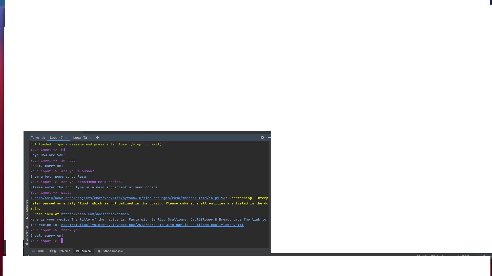

# Recipe chatbot

## Purpose:
The purpose of this chatbot is to recommend a recipe based on a main dish/course using conversational AI. 

## Technologies Used
This chatbot was built with the open source framework Rasa NLU and Rasa Core. The Spoonacular API was used with the endpoints complex search and get recipe information.  

## Functions of the Chatbot
The bot can hold a simple conversion and reminds the user, that it is a bot.
The bot takes input: main/dish type.
The bot then queries the Spoonacular API and returns a recipe based on the user input including the title and a link to the recipe. 

## Example of the Chatbot

## Limitations
The bot has limited responses to the user.
The bot cannot handle requests to the API in the form of a list.

## Future Features
* To improve the bots capabilities
* To deploy the bot on discord for personal use

